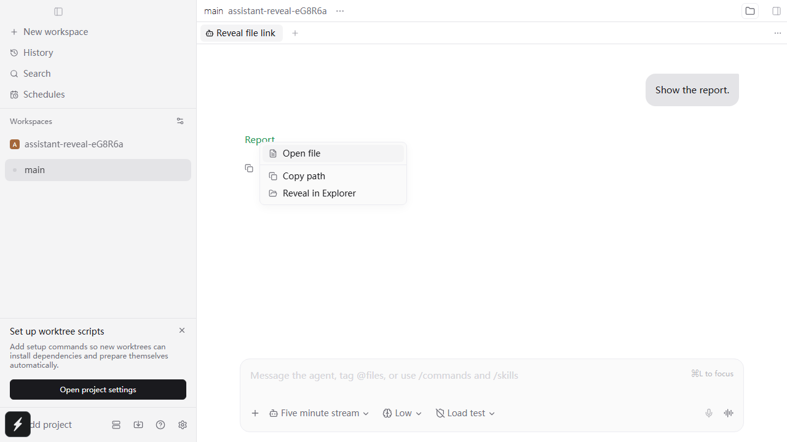

# Assistant file link reveal: QA evidence

Windows 11, Chromium desktop renderer with an isolated real daemon, and a separate native Electron 44.2.0 file-manager smoke test. The renderer tests use the repository's existing `installDesktopRuntime` adapter to record desktop open requests. Native Explorer was checked separately through the production `openEditorTarget` and `createEditorTargetRuntime` functions with no shell adapter replacement.



[Interaction recording](file-link-menu.webm)

## Reproduction before the change

`npm run test:e2e:renderer --workspace=@getpaseo/desktop -- e2e/assistant-file-link-reveal.spec.ts`

```text
Locator: getByTestId('assistant-file-link-reveal')
Expected: "Reveal in Explorer"
Error: element(s) not found
1 failed
```

The same UI test subsequently exposed a line suffix being retained in a file URL. A parser regression test independently reproduced this:

```text
parseFileProtocolUrl("file:///C:/Downloads/sample%20report.txt:2")
Expected: path "C:/Downloads/sample report.txt", lineStart 2
Received: path "C:/Downloads/sample report.txt:2", lineStart undefined
```

## After the change

```text
npm run test:e2e:renderer --workspace=@getpaseo/desktop -- e2e/assistant-file-link-reveal.spec.ts
  ok 1 reveals an assistant file link outside the workspace without its line suffix
  ok 2 resolves relative and inline-code links, and retries a missing file
  ok 3 does not offer a local file manager for a remote host
  3 passed (54.7s)
```

The first test also checks copying the resolved path. The second checks that ordinary HTTPS links keep their existing context-menu behavior. A focused rerun of the first test captured the screenshot after its opening animation settled and passed in 43.7s including environment startup.

```text
cd packages/app
npx vitest run src/assistant-file-links/parse.test.ts --bail=1 --maxWorkers=1
  Test Files 1 passed (1)
  Tests 40 passed (40)

npx vitest run src/assistant-file-links/parse.test.ts src/assistant-file-links/use-file-link.test.tsx --bail=1 --maxWorkers=1
  6 hook tests passed in the earlier combined parser/hook run

npm run typecheck
  All workspace typechecks passed
npm run lint -- <seven changed files>
  Found 0 warnings and 0 errors
npm run format:check:files -- <seven changed files>
  All matched files use the correct format
```

The installed Windows Git hook could not resolve Node correctly from its shell. Its three exact checks were run successfully through PowerShell before committing with that hook disabled for the one commit; the repository's hook configuration was unchanged.

## Native Explorer smoke test

Called the production `openEditorTarget` with the `explorer` target and a real file named `sample report.txt` in an isolated QA directory. Electron exited with code 0. Windows Shell COM reported:

```json
{
  "Directory": "<QA directory>/native-files",
  "Count": 1,
  "Selected": ["<QA directory>/native-files/sample report.txt"]
}
```

The temporary Explorer window and Electron process were closed after verification. No installed Paseo daemon was restarted.

## Platform coverage

| Surface | Coverage |
| --- | --- |
| Desktop renderer on Windows | Playwright against a real isolated daemon; desktop IPC adapter records requests |
| Native Windows Explorer | Real Electron launch, correct directory and selected file confirmed |
| macOS / Linux desktop | Not run; uses the existing Finder / Files targets |
| iOS / Android | Not run; native link rendering does not install this desktop menu |
| Browser without a desktop bridge | Not separately run; file-manager availability follows the existing desktop-target query |

